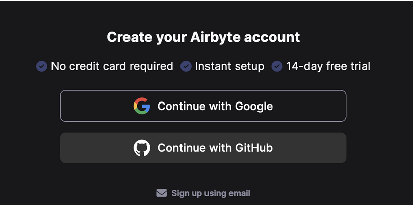
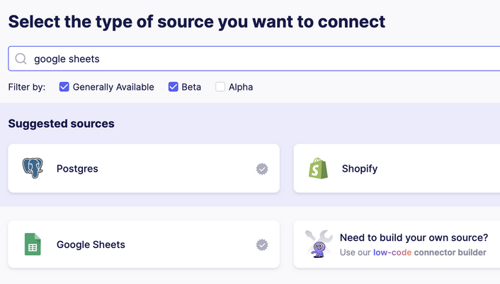
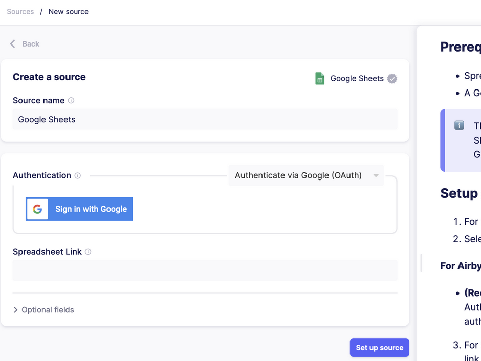
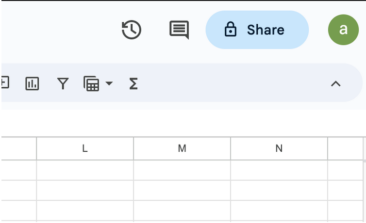
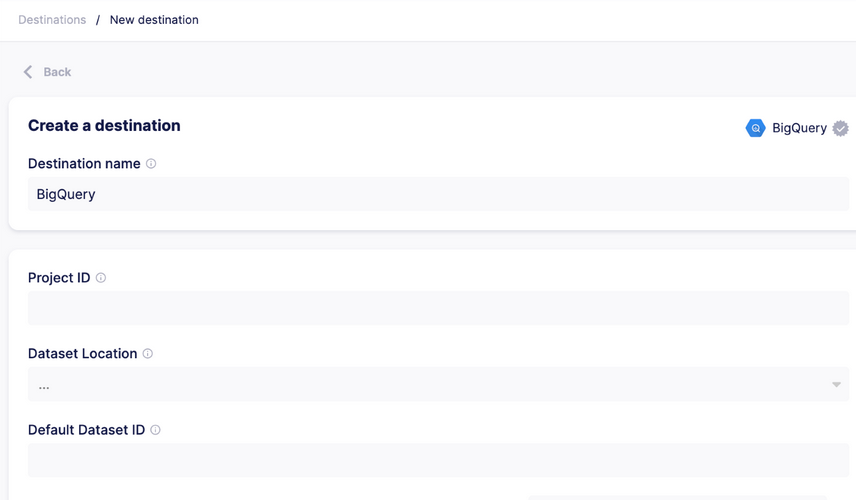
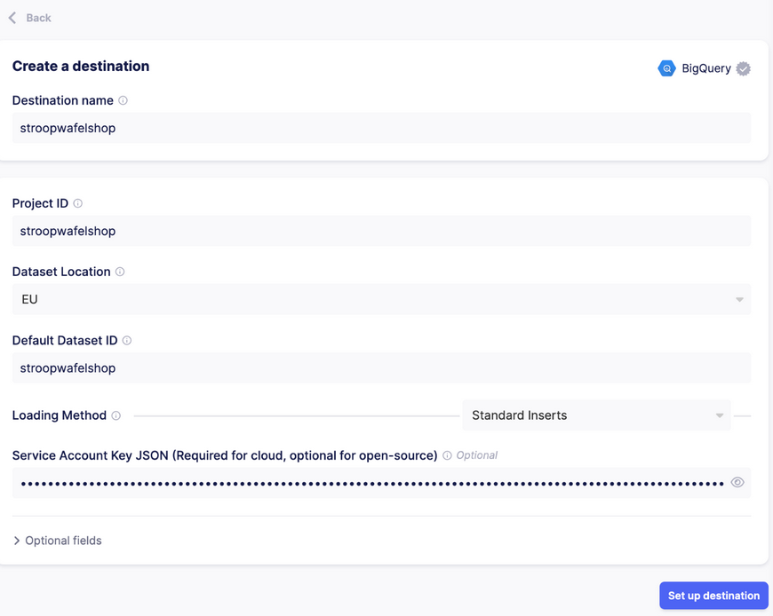
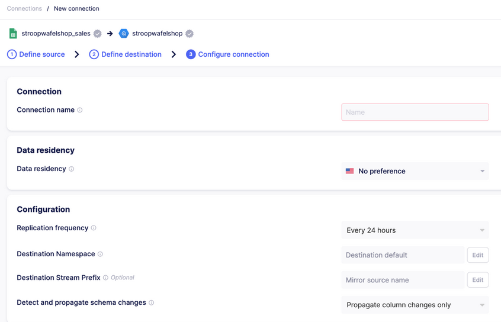
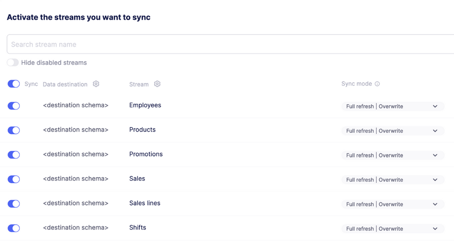
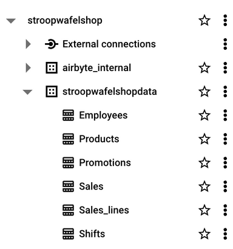

# Setting up Airbyte Cloud

**Requirements**

- From [Uploading the Stroopwafelshop data to Google Sheets](upload_data_to_google_sheets.md)
    - The Google account you used to create the Google Sheet
    - The *stroopwafelshop* Google Sheet

- From [Setting up Google Cloud and BigQuery](setting_up_gcp_and_bigquery.md)
    - The *stroopwafelshopdata* BigQuery dataset
    - The *airbyte* service account with IAM permissions for BigQuery
    - The *airbyte* service account’s JSON key file

**Intro**

This is the step-by-step guide to set up Airbyte Cloud and load the Stroopwafelshop data
from Google Sheets into Google BigQuery. It contains the following sections:

1. Creating an Airbyte Cloud account
2. Creating the Google Sheets connection
3. Creating the BigQuery destination
4. Connection configuration
5. Logging
6. Scheduling
7. Optional challenge

Let’s start!

**Creating an Airbyte Cloud account**

To use Airbyte, you will have to create an account on https://cloud.airbyte.com/signup.
Unlike signing up for Google Cloud, no payment information is required. In fact, you will get
a 14 - day free trial in which you can use Airbyte as you like. After this trial period, you
cannot load (**sync**) more data using Airbyte unless you buy credits. Credits are then
consumed by each sync until they run out. Even if you do not buy the credits your account
will still be accessible, you just will not be able to extract anything anymore. Read up on
https://airbyte.com/pricing to learn more. For the Stroopwafelshop use case, the 14-day
trial will be sufficient, and you will not have to spend any money.

Now, using your Google account, you can leverage Single Sign-On (SSO) to create an
account using Google as the authentication service, eliminating the need for a password.
You can do this by clicking Continue with Google. Alternatively, you can set up an
account by signing up using email at the bottom (as shown in Figure 1).


<p align="center">Figure 1 - Signing up for Airbyte</p>

Once the registration process is complete, you should see the main screen where we are
welcomed by the Airbyte visual.

Next, we want to create our first *connection*. In Airbyte, a connection loads data from a
*source* to a *destination* , for instance from Google Sheets to Google BigQuery. Airbyte
supports a variety of sources and destinations. Click to create the connection. Next up, you
will see a list of available source connectors.

> Note:
>
>There are many kinds of connectors, some have been created by the Airbyte team, others
are a product of the open-source community. Read more about the available connectors on
https://docs.airbyte.com/integrations/.

**Creating the Google Sheets connection**

In this case, we want to connect to Google Sheets, which is officially supported by
Airbyte. Search for **Google Sheets**, as shown in Figure 2 , and choose it.



<p align="center">Figure 2 - Searching for the Google Sheets source></p>

In the New connection screen, rename the Source name to *stroopwafelshop_sales*. 
We want to give each source a unique name to distinguish them from each other, since we will connect to each tab in our Google Sheet.  Next, click **Sign in with Google** to give access to your Google Sheets account using SSO, as shown in Figure 3.


<p align="center">Figure 3 - Authenticating with a Google account using SSO</p>

By using SSO, you grant Airbyte access to directly read from Google Sheets using your
credentials. Airbyte will handle authentication and store the credentials for you.

> Note: SSO vs service account
>
> For simplicity, we choose to authenticate with your Google account using SSO.
> Since you created the spreadsheet earlier using the same account, you should be to access it using its URL.

Next, you will need to visit the Google Sheet you created earlier and fetch the link to the
Sheet. In our Google Sheet, click the Share button in the top right corner (shown in Figure
4).


<p align="center">Figure 4 - Sharing the Google Sheet</p>

<!-- markdown-link-check-disable -->
Then in the pop-up, select the Copy link button to copy the spreadsheet’s URL. It should
be similar to https://docs.google.com/spreadsheets/d/12345/edit#gid=0.
<!-- markdown-link-check-enable -->

**Add the spreadsheet link in Airbyte**

Back in Airbyte Cloud, paste this URL in the *Spreadsheet Link* field. All of these steps are
listed on the documentation screen in the Airbyte UI as well. The information is limited for
the Google Sheets connector since it is straightforward, but for other connectors, there are
many options that the documentation helps explain.

Next, select **Set up source**. Airbyte will test the source configuration, connecting to
Google Sheets with the provided credentials. This way, any issues with authentication to or
loading from the source can be detected before continuing to set up the destination, which
is the next step.


**Creating the BigQuery destination**

After the source has been set up, you should see the destination screen. Just as searching for
the source, you can search for the destination. Search for the BigQuery connector, and select
it.

In the BigQuery destination set-up, shown in Figure 5 , we can use all the information that
we collected when setting up Google Cloud and BigQuery, including the *service account
key file* you downloaded earlier (refer to [Setting up Google Cloud and BigQuery](setting_up_gcp_and_bigquery.md)).


<p align="center">Figure 5 - Creating the BigQuery destination</p>

First, set the **Destination name** to *stroopwafelshop* in order to identify the
destination in Airbyte. Then, fill in your Google Cloud project id (which you can find in the
Google Cloud console and should be similar to *stroopwafelshop-12345*)
in the **Project ID** field.

Back in Airbyte, fill in *stroopwafelshopdata* in the **Default Dataset ID** field. Once
Airbyte extracts the data, it will first create the dataset in the specified location, and then
create tables inside it. For authentication, you can now use the (JSON) key file that you
downloaded earlier for the *airbyte* service account.

Open the file you downloaded before using a text editor (Notepad, Microsoft Word) and
copy & paste the entire contents into the **Service Account Key JSON** field. Airbyte will
store this secret (and other connection secrets) securely. For more information on Airbyte’s
security principles you can visit https://docs.airbyte.com/operator-guides/security.


You can finalize setting up the destination by selecting **Set up destination** as
shown in Figure 6.


<p align="center">Figure 6 - Setting up the BigQuery destination</p>

Airbyte will check the validity of the details and credentials you provided, similar to setting
up the source _,_ to make sure everything is working.

Once the destination has been tested, you will be shown the last page of the Connection
configuration, as shown in Figure 7. Almost there!

Figure 7 - Connection configuration

<p align="center">Figure 7 - Connection configuration</p>

**Connection configuration**

Here, you can adjust settings related to the *syncing* (data loading) of the connection. For
instance, you can set the *data residency*, which indicates if the data should be processed
by Airbyte’s servers in the United States, or in Europe, which might be a security
requirement for some companies. Then there is the *replication frequency*, which is the
schedule that the sync should be run at. This can be changed to fit your needs. By default, it
refreshes the data every 24 hours. For now, keep all settings on their defaults.

At the bottom of the screen, you can see a list of *Streams*, all corresponding to the
worksheets in the source. A source can contain one or more streams, which are individual
units of data inside the source. This would be all the tables in a database source, and in our
Google Sheet, they are the individual worksheets (tabs). Since we have six different tabs
(*Sales*, *Sales lines*, *Products*, *Promotions*, *Employees* and *Shifts*), we will see the different streams as shown in Figure 8.


<p align="center">Figure 8 - Streams in the Connection</p>

Airbyte treats the streams as separate components inside the connection. Next to each
stream, you can see the *sync mode*, which indicates that each time we run a sync, it will
fetch all data in the stream and overwrite the existing data in the destination. Another
option would be to *append* data to the table. In our case, overwriting is fine, so keep the
default option. You can read up on all the options of syncing data and dealing with changing
schemas at https://docs.airbyte.com/cloud/managing-airbyte-cloud/configuring-connections.

Next, make sure that all streams will be synced by toggling the *Sync* button. Finally, select
the **Set up connection** in the bottom right corner to save the configuration. Now
that everything has been set up, Airbyte can execute its first sync by clicking the *Sync now*
button on the right. It will take a couple of moments, but after a while, you should see that
the sync was successful.

```
Take a look in BigQuery, you should see that the tables have been created in the
*stroopwafelshopdata* dataset, as shown in Figure 9.
```


<p align="center">Figure 9 - Tables created in the BigQuery</p>

Alongside *stroopwafelshopdata*, you can see that Airbyte created another dataset
called *airbyte_internal* which it uses to store copies of the raw data during
extraction. You can safely ignore this dataset for now. The actual datasets are stored in the
*stroopwafelshopdata* dataset.

Looking at the *Employee*s table, we can see the fields from the data that we
expected, like *role*, *hourly_rate*, *name*, and new fields that were added by Airbyte. These
fields such as *__airbyte_raw_id_* , and *__airbyte_extracted_at_* are *metadata* and give us details
about when the data was ingested as shown in Figure 10.


<p align="center">Figure 10 - Airbyte’s metadata fields</p>

Whenever you load data into a database, you should add an ingestion date and timestamp
to indicate that data is *fresh* (recent)._ Also, it will help with debugging issues later.

You can [read up on Airbyte’s documentation](https://docs.airbyte.com/integrations/destinations/bigquery#raw-table-schema) to understand the intricacies of the fields
added. Learning to navigate documentation, be it for a tool such as Airbyte or a cloud
platform like Google Cloud, is a crucial skill for an Analytics Engineer. Working with
technology means that new features are constantly added, meaning you will have to keep
up with the technology you are using.

**Logging**

Back in Airbyte, we see that there are still other options left undiscussed. We have multiple
tabs available to us, such as **Status**, **Job History**, **Replication**, **Transformation**, and **Settings**.
Click on the Job History tab to move to the history overview, as shown in Figure 11.


<p align="center">Figure 11 - Job history</p>

In here, we see details on the sync that was performed. A summary of the sync tells us that it
was a successful run, the size of the data transferred (*5.08MB*), the amount of records
extracted from the source and loaded into the destination (both *32,115* records) and the
duration (*3m 59s*). Furthermore, you can download the logs of the run by clicking on the
three dots and choosing **View logs**, as shown in Figure 12.


<p align="center">Figure 12 - Logging details</p>

By viewing the logs, we can see the actual *SQL* statements executed by Airbyte in BigQuery
and gain a better understanding about what Airbyte is doing behind the scenes. In case of
errors during a sync it is tremendously helpful to have the logging available.

One of the standout features of tools like Airbyte is their *built-in logging and monitoring*,
which is readily accessible. When data professionals initially build pipelines using code, they
often overlook or inadequately implement crucial aspects like monitoring and logging. While
coding these features into data pipelines can feel tedious, they prove invaluable when
troubleshooting unexpected data loading problems. This principle is central to Analytics
Engineering: rather than starting from scratch, it is more efficient to use top-tier tools with
these built-in capabilities. This approach allows professionals to focus more on data analysis
and less on the extraction process.

**Scheduling**

*Scheduling* is another one of Airbyte’s key features. At its core, scheduling refers to
automating tasks to run at specific intervals. Often a business will want to update its data
daily for reporting purposes. Because of this, it is common to see a morning schedule that
loads the data from source systems before the workday begins. If we were to connect to the
Point of Sales database, we might want to start loading the data on such a schedule, but for
now it is not necessary since all the data we need is present in the Google Sheet.


Currently, we left the syncing schedule on the default of “every 2 4 hours”. However, this
setting can be adjusted in the **Replication** tab. Here, you will find several interval options
most of which allow you to set updates a specific number of hours apart. An exception is the
**Cron** setting, which is a special syntax for scheduling. With it, you can define granular
scheduling patterns, allowing tasks to run at precise times or on specific days. This flexibility
enables more complex scenarios, such as running updates every weekday at a particular
time, or even multiple times a day at specific intervals. The power of the *cron* setting lies in
its ability to cater to almost any scheduling requirement you might have. A helpful utility for
working with the cron syntax is https://crontab.guru/ since it will output the time and date
corresponding to the specified syntax.

Lastly, it’s good to know that there exist dedicated tools for scheduling, such as *Apache
Airflow* , *Dagster* and many others. These tools are popular due to their powerful and
intricate functionality for executing jobs. This type of tooling creates a sequence of
dependencies between tasks, commonly referred to as a *Directed Acyclic Graph* (DAG).

Tasks are executed in a specific order, ensuring that one task finishes before another
dependent task begins. They can even call tooling such as Airbyte by leveraging its API and
start extraction. Once a project grows larger and requires the execution of custom code, in
combination with calling different API, it may be wise to explore these tools. For example,
the scheduler could first start Airbyte’s daily sync and immediately afterwards kick-off dbt to
transform the data before finally sending a slack message on successful completion. Any
errors would become visible in the scheduler’s UI, instead of being scattered between
applications.

However, for small projects such as ours, they are not necessary and only add more
complexity. Still, it is good to evaluate the scheduling aspect of your projects. If none of the
tools you use offer adequate scheduling, or every tool has its own scheduler and this is
becoming too much to bear, this might serve as an opportunity to investigate a dedicated
scheduling tool.

By now you have set up a successful sync into BigQuery and explored some of the key
features of an ELT tool like Airbyte. The next step is to start working with the data! Go back
to *Chapter 8 - Hands-on Analytics Engineering* where you left off.

**Optional challenge for the reader: Using Postgres**

As an Analytics Engineer, you will often be unsatisfied by being provided spreadsheets. Rather, you would grab the data at its source, which is often a (transaction) database system. In the Stroopwafelshop use case, this would be the database behind the Point-of-Sale system that registers the sales in the store. For simplicity's sake, we did not choose to load the data into a database system, and relied on using Google Sheets instead. Furthermore, using Google Sheets as the source demonstrates Airbytes' capabilities in connecting to SaaS products.  However, when working as an AE it is common to connect to a source database and load the data in its raw form, especially in ELT architecture.

To practice this, you could can set up a *Cloud SQL PostgreSQL* instance in Google Cloud, upload the data from the spreadsheets, and use Airbyte to connect and load the data into BigQuery.

[*PostgreSQL*](https://www.postgresql.org/about/) is a very popular relational database management system that serves as a datastore for many companies, both small and large. Having experience with running and connecting to one is a good skill to have as an Analytics Engineer.

How to set-up an instance of Postgres, upload the data into it, and connect to it from Airbyte Cloud is beyond the scope of guide (and the book). For information setting-up such an instance, see https://console.cloud.google.com/sql/instances and https://docs.airbyte.com/integrations/sources/postgres/.


