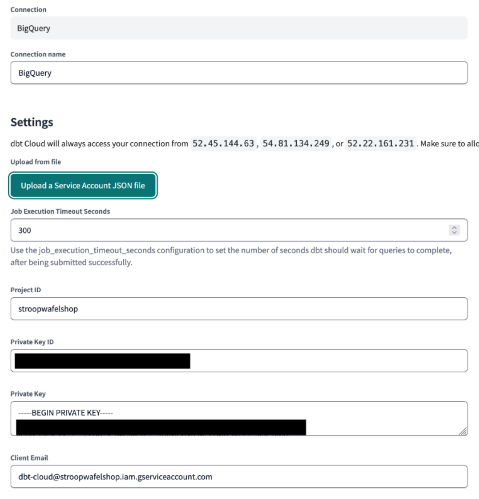
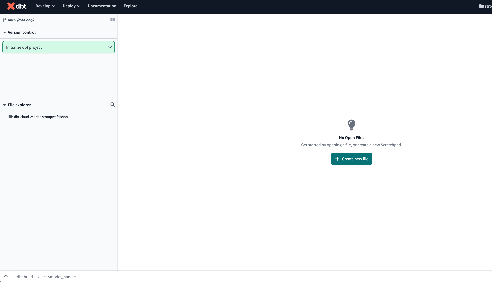

# Setting up dbt Cloud

**Requirements**
- From [Setting up Google Cloud and BigQuery](setting_up_gcp_and_bigquery.md)
    - The *stroopwafelshopdata* BigQuery dataset
    - The *dbt-cloud* service account with IAM permissions for BigQuery
    - The *dbt-cloud* service account’s JSON key file

**Intro**

This is the step-by-step guide to set up dbt Cloud for modeling the Stroopwafelshop data. It
contains the following sections:

1. Creating a dbt Cloud account
2. Setting up the connection to Google BigQuery
3. Testing the connection

Let’s start!

**Creating a dbt Cloud account**

Create a dbt cloud account at https://cloud.getdbt.com/signup/. You can use the same
email you used to sign up for Google Cloud. dbt Cloud offers a free plan for a single user,
perfect for our needs, refer to https://www.getdbt.com/pricing/ for more information on
the pricing plans. Choose *stroopwafelshop* as the company name when creating your
account.

**Setting up the connection to BigQuery**

dbt Cloud needs a connection to a database or data warehouse to function. You will see the
icons of the different supported data warehouses, as shown in Figure 1. Additional data
warehouses are supported by the dbt open-source package. The connectors to different
warehouses, databases or data platforms are called adapters. You can view the full range of
adapters here: https://docs.getdbt.com/docs/supported-data-platforms.


<center>Figure 1 - Supported data warehouses in dbt Cloud</center><p></p>


Here are the steps you need to follow to connect to BigQuery:

1. Select **BigQuery**. In the following screen you will be asked for
    credentials (as shown in Figure 2). We will use the service account key file that you
    created earlier for the *dbt-cloud* service account.

2. Locate the *dbt-cloud* service account key file on your computer, and select **Upload a Service Account
    JSON** file to upload it into the dbt Cloud interface. It should automatically fill in all
    the empty fields on the page.


<center>Figure 2 - Uploading the service account JSON file</center><p></p>


3. Then scroll all the way to the bottom of the page. The only thing you should adjust is the **Dataset** name. Change it to *dbt_firstname_lastname*, filling in your personal information.


In dbt, each developer should have their own dedicated dataset (called *schema* in other data
warehouses) in which they develop. Each developer will always have their own copy of the
master data to work with. Each time you run dbt, the source data is read, and the SQL
transformations are applied. The resulting tables and views are then placed in your dataset.
Once you are happy with your code, you can promote the code to be run on the dedicated
“production” dataset, which is available for consumption by end users.

3. Next, select **Test Connection**. If everything was successful, select on **Next**.
4. Now we will have to set up a code repository.  All the code in dbt lives in a repository, which is essentially a version-controlled folder.  This is similar to a Google Drive folder in the way that every change in this folder is tracked and it is possible to replay changes inside of it. However, unlike a Google Drive folder, a repository is meant to be used with *Git*, which is the de facto standard of version control systems for working with code.

**More on Git**

Git provides powerful features that make collaborating with multiple developers easier. You
can read up on Git’s features and its use in dbt Cloud on
https://docs.getdbt.com/docs/collaborate/git-version-control. These repositories can be
created and hosted on different platforms, one of the most popular being Microsoft’s
GitHub. The open-source version of dbt is also hosted on GitHub: https://github.com/dbt-
labs/dbt-core. If you were to use a hosting platform, you would then provide credentials to
dbt Cloud and point it toward the repository URL. dbt Cloud would then pull the code from
the repository and run it. These hosting platforms also offer more advanced collaboration
and automation features, making them an excellent next step in your journey after this
project.


5. For now, we will make use of dbt’s own Managed hosting for the repository. Type in
    *stroopwafelshop* as the name, as shown in Figure 3, and click Create. You should be congratulated in the following screen. Well done!


<center>Figure 3 - Repository hosting in dbt</center><p></p>

6. Click on Start developing in the IDE. This will bring you into the Integrated
    Development Environment, also known as the IDE, as shown in Figure 4.


<center>Figure 4 - The dbt Cloud IDE</center><p></p>

**IDEs – A quick overview**

An IDE is a tool for developers to write, run, and debug code. Some IDEs are specific to a
certain programming language while others support multiple languages. Software engineers
have been using IDEs for decades to produce reliable software and modern IDEs are full of
helpful features that you cannot get with a text editor or command line interface. Some of
the most popular IDEs include Microsoft Visual Studio Code and IntelliJ IDEA, which both
have free versions. Since all of the dbt project’s code lives inside a repository, and the open-
source version of dbt is a Python package that is usable from the command line, it is
possible to download both to your local machine and use an IDE of your own choice. In fact,
plenty of analytics engineers do this. However, if an IDE is a new concept to you then dbt
Cloud’s browser-based IDE offers a gentle introduction to working with one. Read more
about the dbt Cloud IDE on https://docs.getdbt.com/docs/cloud/dbt-cloud-ide/develop-
in-the-cloud.

7. Next, in the top-left corner, select **Initialize dbt project** button. This will set up the project and create all the files necessary in the **File Explorer**.

**Testing the BigQuery Connection**

Test that the connection from dbt Cloud to BigQuery is working and that we can access the
data. Select **Create New File** and enter the following SQL query:

```
select * from stroopwafelshop.Employees
```

Make sure that *Employees* is capitalized. Then, select **Preview**.

The dbt Cloud IDE will send the SQL to be executed to the data warehouse, in this case
BigQuery, and display the results in the IDE (as shown in Figure 5). 


<center>Figure 5 - Preview results</center><p></p>

Since there are only a few rows returned, all will be displayed. This confirms that the connection works, and we can move on in chapter 8.

### Errors in the connection to BigQuery

If you encounter errors while trying to preview the query results, these are likely due to an
issue with the BigQuery connection in dbt Cloud, or with the permissions granted to the
service account you are using. Ensure that you followed the steps in [Setting up Google Cloud and BigQuery](setting_up_gcp_and_bigquery.md) correctly.


