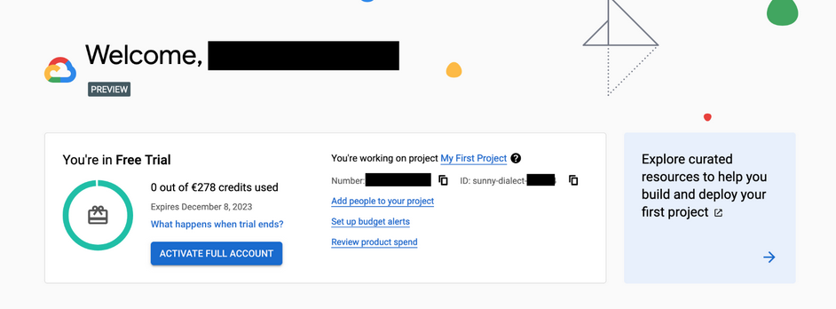
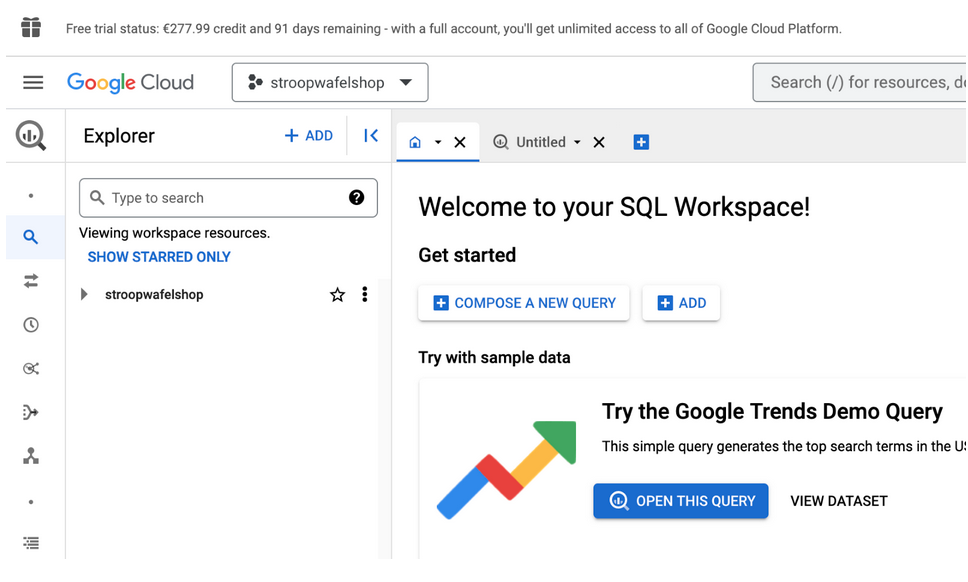
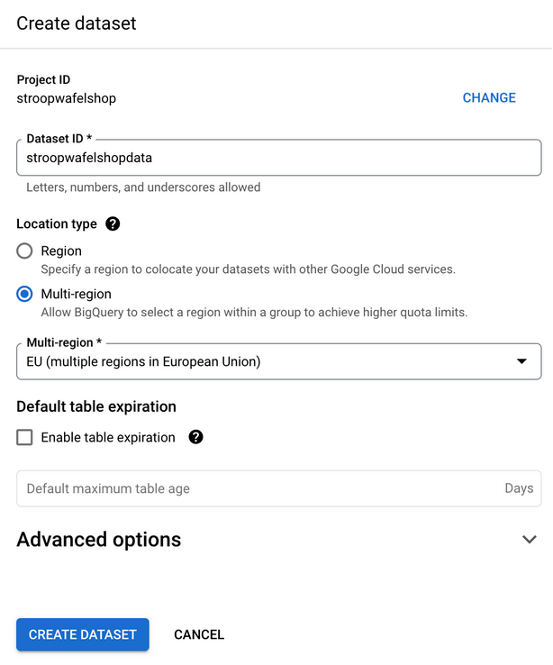
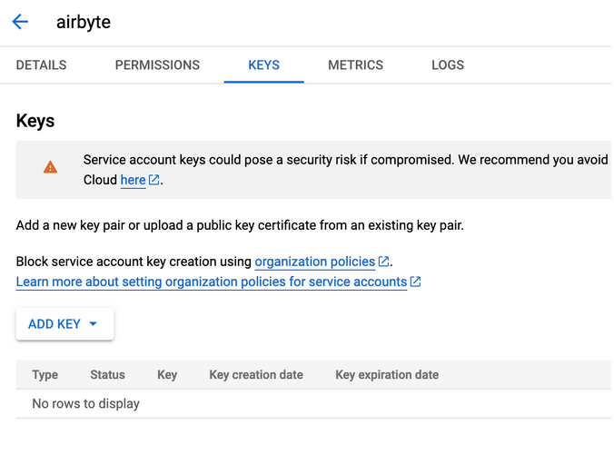

# Setting up Google Cloud and BigQuery

**Intro**

This is the step-by-step guide to set up Google Cloud and Google BigQuery as part of the
Stroopwafelshop project. It contains the following steps:

1. Creating a Google Cloud account
2. Creating a project in Google Cloud
3. Creating a BigQuery dataset
4. Creating a service account for Airbyte with permission to access BigQuery
5. Creating additional service accounts for dbt Cloud and Tableau

Let’s get to work!

**Creating a Google Cloud account**

To use BigQuery you will need to set up an account in Google Cloud. Google Cloud charges
for the use of many of its services, including BigQuery. However, BigQuery offers a generous
monthly free tier which should be more than enough to follow along in the chapter (read
more on https://cloud.google.com/free/docs/free-cloud-features#bigquery. If you already
have an account in Google Cloud, you should be able to make use of this offering and do not
need to create a new account.

If you do not own an existing Google Cloud account, you can create one and get $300 dollars
in free credits during a 90-day trial period, after which there are no costs unless the user
explicitly upgrades from the trial mode to a full account (as of February 2024). To create this trial account, you will need to provide credit card details, although
no money will be charged, and you do not need to spend money during or after following this
chapter.

If you already have an existing Google Cloud account with valid payment information, you
can use that and skip the account creation steps described below. However, if you have an
account but do not have usable credits, you can still create a new account.

Unfortunately, there is no way to make use of the full features of Google BigQuery which we
need for the chapter, without providing payment information. As stated, you will not be
charged anything as long as you don’t manually upgrade the account, which is not necessary
for following the chapter. Furthermore, Google Cloud is the only tool that we will use that
requires you to give any payment details at all.

> Note:
>Google also offers a totally free version of BigQuery called BigQuery Sandbox. You can use it
without providing payment information. However, this sandbox environment is more
limited and does not support certain features that are required by Airbyte. This is why we
still have to provide payment information to access the full capabilities of BigQuery. Read
more on BigQuery Sandbox here: https://cloud.google.com/bigquery/docs/sandbox.

If you want to create a new account: visit the page on https://cloud.google.com/free and fill
in your details. After filling in the details, Google verifies the payment details and might
require confirmation. Next, you should end up in the home screen where you are greeted
with some information on your account (as shown in Figure 1).

Figure 1 - Google Cloud welcome screen

As you can see, you are using the *Free Trial* mode, with the full amount of credits
remaining. The big blue button **Activate Full Account** indicates the manual step
necessary to upgrade your account. As long as you do not click (and confirm) that, you
will not be charged anything. So, finger off the trigger button! Furthermore, you can read
on the page that you are working on a project called *My First Project*, which is the default
project created for you.

> You can watch the following steps in this video
>
> https://github.com/PacktPublishing/Fundamentals-of-Analytics-Engineering/assets/7990862/eb4f9024-7967-4ef5-bcdb-334349503bc1

**Creating a Project**

A project is the fundamental building block in Google Cloud, and most services need to be
associated with a project before you can use them. billing, access management, and
resource creation are all tied to a project, and it is possible to create multiple projects in an
account and switch between them.

Create a new project called *stroopwafelshop*. Next, we will set up BigQuery for data
loading.

**Setting up BigQuery**

Navigate to https://console.cloud.google.com/bigquery. You should be greeted by
BigQuery’s welcome page, as shown in Figure 2.

Figure 2 - Google BigQuery landing page

This shows the SQL Workspace, where you can import data to create tables and then use
SQL to query them. BigQuery also has many other features, such as exploring public
datasets, transferring data from various sources, scheduling queries, etc. We will stick to the
basics by creating tables from raw data and modeling them using SQL. First, we will need to
create a dataset.

**Creating a BigQuery dataset**

In BigQuery, a dataset is a container for tables, views, and other data structures. It
provides a way to organize and control access to these structures, much like how a folder
organizes files on your computer. We want to create a dataset to store the source data.

Choose the option to create a new dataset, and name it *stroopwafelshopdata*. When
creating a dataset you must specify a location for the storage. This can be a specific region
such as europe-west1, or a multi-region location such as the US. Since the
Stroopwafelshop is in the EU, we will select *EU*, as shown in Figure 3. Leave the other
options as they were and select **CREATE DATASET**.

Figure 3 – Creating the dataset

After creating the dataset inside of your project, it should be visible on the left-hand side of
the screen. Next up, we will create service accounts that are allowed to access the
dataset.

**Creating service accounts**

When using Google Cloud, you can navigate to the webpage using the browser as we’ve
been doing, and interact with other services from there. This part of Google Cloud is called
the **console** (https://cloud.google.com/cloud-console).

Before being able to use the console, you must authenticate by logging in. Once logged in,
Google takes care of all authentication and authorization. But if you want to connect to
these services using a third-party application or software, you will need to authenticate
with Google’s services.

Essentially, whenever an application such as Airbyte wants to communicate with Google’s
services over the internet, they will first have to prove that they are allowed access to your
project in Google Cloud and be able to read your data. Generally, this is done by creating
special non-user accounts. These accounts are commonly known **service accounts**. A
service account can be assigned granular permissions. For instance, they could be permitted
to only use a single service, such as BigQuery. This can help reduce the potential damage in
case of a compromised account. Therefore, it is best practice to create a separate service
account for each application that needs to access the cloud platform, and only assign them
permissions they need, not more. Considering this, let’s create the service account.

In Google Cloud, visit the **IAM** (Identity and Access Management) page. This is where
the permissions in your project can be managed. You can either search for the service in the
search bar or access it from https://console.cloud.google.com/iam-admin/iam. In the
sidebar on the left, choose **Service Accounts**. This will show all existing service accounts
(as shown in _Figure 4 ). Currently you do not have any.

Figure 4 - Service accounts overview

Create a service account called *airbyte*. Once created, a unique identifier in the form of an
email address is generated in the form of name@project.iam.gserviceaccount.com. In our
case, it will be _airbyte@stroopwafelshop.iam.gserviceaccount.com_. Add a description to
specify its use, as shown in Figure 5.

Figure 5 - Creating the service account

Next, select the option to grant access to a project. We will grant permission to the service
account to access our project, and specifically, BigQuery. The easiest way for this is to select
a pre-defined role, as shown in Figure 6.

Roles in Google Cloud act as a bundle of pre-defined permissions, defined by Google for a
specific workload. In our case, we need the **BigQuery User** and **BigQuery Data Editor**
roles to interact with the BigQuery service from Airbyte.This will allow read and write access to the BigQuery datasets in the project.

For more information on this role, see https://cloud.google.com/bigquery/docs/access-control and https://docs.airbyte.com/integrations/sources/bigquery#service-account).
Additionally, we could allow access to specific datasets in the BigQuery console, but for now,
this is not required. Select both roles, and finally create the account.

Figure 6 - Selecting the BigQuery User and BigQuery Data Editor roles

This should bring you back to the Service Accounts page where you started, but with the
newly created service accounts’ email address visible in the middle of the screen. Next, we need to create a key to serve as credentials for our service account.

**Creating a Service Account Key Pair**

In Google Cloud, a service account key works much like a password, but it's actually a pair of
cryptographic keys designed to authenticate your account with Google Cloud services.
Essentially, when you want to connect to Google Cloud from any third-party application,
you'll need to create this key file. Think of it as creating a special access pass that these
applications can use to safely interact with Google Cloud on your behalf. It's crucial to handle
this key file very carefully; if it falls into the wrong hands, they could gain unauthorized
access to your Google Cloud resources. You can read more on service accounts keys here:
https://cloud.google.com/iam/docs/best-practices-for-managing-service-account-keys

Now, navigate to the key creation page (as shown in Figure 7) and create a new *JSON* key
type. Once it’s created, you should download it to your local machine. Treat this with care!
As a security measure, you cannot download or see the private key again. In case of a lost
private key, you will have to create a new key pair and delete the old key.

Figure 7 - Creating a service account key

You can open this file with a text-editor and take a look at the contents if you want. You will
see that it contains a key-value mapping of different attributes such as *client_email*
which corresponds to the service account’s email, and most importantly the *private
key*, which maps to the long string of letters and words. As you can see, the string does not
make much sense to us humans. Nevertheless, it is important to keep the key secure and
only hand it out to trusted parties. Next step: creating additional service accounts.

**Creating additional service accounts**

You just created a service account for Airbyte. During the Stroopwafelshop use case, we will
also make use of dbt Cloud for modeling the data and Tableau for visualizing the results.
Since it is a best practice to create separate service accounts for each third-party service,
you should create two more service accounts: one for dbt Cloud, and one for Tableau.

For the dbt service account, choose *dbt-cloud* as the name, and assign it the **BigQuery
Data Editor** and **BigQuery User** roles during the creation process. Then generate a key
and download it, like you did previously. Next, for the Tableau service account, choose
tableau as the name, and assign it the **BigQuery Data Viewer** role for read-only access.
Finally, create the key file and download it. Return to the **IAM** overview. It should list your
email address and the three service accounts with their assigned roles, as shown in Figure
8.

Figure 8 – Three service accounts

Equipped with your service accounts, you are now ready to load data into BigQuery and
interact with the third-party services. Continue where you left off in *Chapter 8 - Hands-on
Analytics Engineering*.

