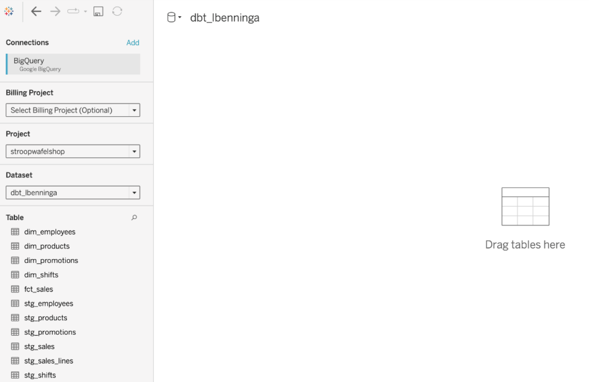
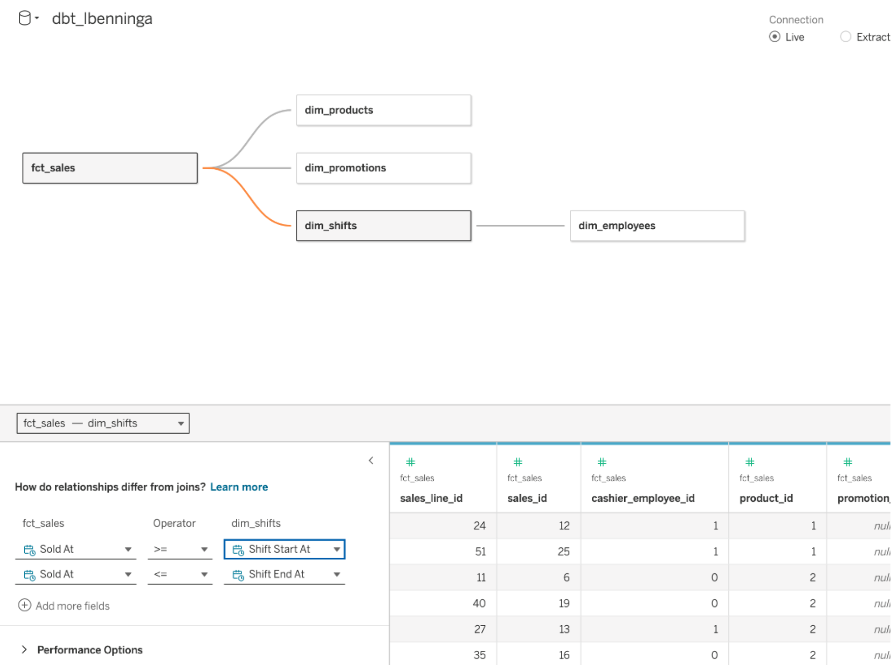

# Setting up Tableau

**Requirements**
- From [Setting up Google Cloud and BigQuery](setting_up_gcp_and_bigquery.md)
    - The *tableau* service account with IAM permissions for BigQuery
    - The *tableau* service account’s JSON key file

- From [Setting up dbt Cloud](setting_up_dbt_cloud.md)
    - The *dbt_<your_name>* dataset that was created in BigQuery

**Intro**
This is the step-by-step guide to set-up Tableau for creating the visualizations. It contains the
following sections:

1. Downloading and installing Tableau Desktop
2. Connecting to Google BigQuery
3. Creating the relationships
4. Employees and shifts

Let’s start!

**Downloading and installing Tableau Desktop**

You can register a Tableau account and download a 14-day trial of Tableau Desktop on
https://www.tableau.com/products/desktop/download. Both Windows and Mac are
supported. Creating a Tableau account does not require payment details, and there is no
charge or payment obligation after the 14-day trial. If you want to keep using Tableau
Desktop after the trial period, you will be prompted to buy a license.

After you have downloaded the desktop client, install the software, and log in with your
newly created credentials.

>Note: Tableau Desktop
>
>Besides Tableau Desktop, Tableau also offers a more limited, but free desktop client called
Tableau Public. Tableau Public does not support connecting to BigQuery. You can
circumvent this by exporting your tables using BigQuery’s UI into CSV files and loading these
into Tableau Public.
>
>If you want to see Tableau in its full glory, you can purchase a license, use a trial, or request
an academic license (if you are a professor or student).

**Connecting to Google BigQuery**

One of Tableau’s most appealing features is its multitude of connectors. Tableau connectors
enable loading data from various sources into Tableau. They provide a straightforward
method for users to access and import data, whether it's from databases, spreadsheets, or
cloud services. For our use case, we simply need to connect to BigQuery. In the home page,
we can choose **Google BigQuery** and select **signing in with a service account**, as
shown in Figure 1. Upload the *tableau* service account key that you downloaded earlier,
and sign in.

Figure 1 - Connecting to BigQuery in Tableau

Next, you will need to select the *stroopwafelshop* project and your dbt dataset
(*dbt_lbenninga* in my case). You will see all available tables on the left-hand side as shown
in Figure 2. If you cannot see the dataset/tables, make sure that you followed the steps for creating the service account in [Setting up Google Cloud and BigQuery](setting_up_gcp_and_bigquery.md) correctly.

Figure 2 - dbt models in Tableau

**Creating the relationships**

Tableau allows users to create *relationships* between different tables of data. It will use the
appropriate join type based on the defined visualizations. This approach offers a more
flexible and intuitive way to work with your data, allowing for complex analyses without the
need for intricate SQL queries or pre-aggregating your data. Read more on Tableau’s
relationships feature on https://help.tableau.com/current/pro/desktop/en-us/relate_tables.htm.

Drag the *fct_sales* table onto the canvas on the right to start creating the data model. It
is important that the left-most model is the fact table since the analyses will be run from its
viewpoint. Next, drag the *dim_products* to the right of *fct_sales*. This will create a
relationship between the two tables, and at the bottom of the screen you will need to
select the *join* fields to connect the data. Choose the appropriate field, which is called
*product_id* in both tables. This will display the matched data in the bottom-right portion
of the screen and confirm that the join key was valid.

Repeat the process for the *dim_promotions* table (**not** the *dim_shifts* and
*dim_employees* yet) by dragging the tables onto the canvas and matching the *join* keys.
Now you have three dimensions to the right of *fact_sales*.

**Employees and shifts**

The *dim_employees* is slightly different from the other dimensions. A sale has an
employee_id, which is the one for the cashier, but a shift consists of two employees. If
we match the *dim_employees* to the *fct_sales* marts, we will only count sales
toward the cashier. Since two people operate the store, Jan stresses that it is essential that
both people are counted per sale. To achieve this, we need to match a sale to all the
employees who were working the shift during the sale.

First, drag the *dim_shifts* table onto the canvas and match with *fct_sales*. Next,
match the *sold_at* field to the *shift_start_at* and *shift_end_at* fields, using
the **>=** and **<=** operators so we match all shifts that were active during the sale. Then, drag
the *dim_employees* mart onto the canvas to the right of the *dim_shifts* match them
on the *employee_id* field.

Now, *fct_sales* will be connected to *dim_employees* through *dim_shifts*, and
Tableau can aggregate the sales for all employees related to the sale’s shift hours.

With all the connections in place, as shown in Figure 3 , the data model is now ready to be
used in visualizations.

Figure 3 - Defining the relationships in Tableau

Now that the relationships have been defined, you can go back to the chapter and continue with creating the visualizations.

